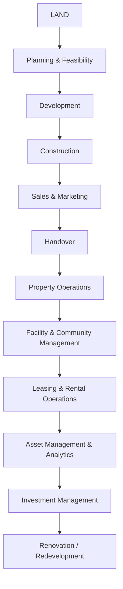
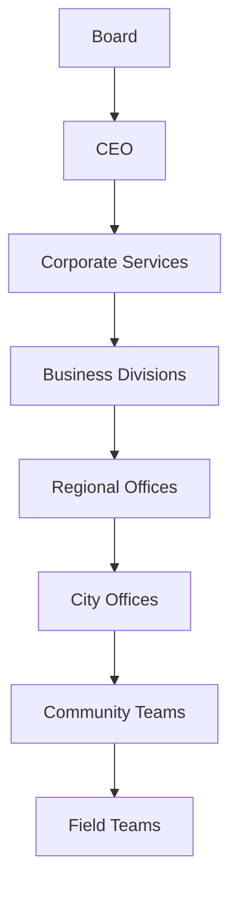

# VISION
To build the world's most intelligent Real Estate Operating System that manages every stage of a property's lifecycle—from land acquisition to construction, sales, leasing, operations, maintenance, investment, and eventual redevelopment.

> *I think this is the right moment to pause designing features and instead design the company itself.*
> 
> What you're asking for is not "what services should we offer?" You're asking:
> **"If this company exists 30 years from now and is one of the largest real estate companies in the world, what does it look like?"**
> 
> I'll answer that from first principles.

---

## THE COMPANY

**Working Name:** We'll call it **Asset Operating Company (AOC)** until you finalize branding.  
*(This is not the final brand. This is the philosophy.)*

### Core Belief
Most companies think of real estate as buildings. **We think of real estate as living assets.**
Every property is an economic engine. Every property:
- Generates income
- Consumes money
- Depreciates and Appreciates
- Requires maintenance
- Has customers (tenants/residents)
- Has suppliers (vendors)
- Has financial statements
- Has operational KPIs
- Has legal obligations
- Has environmental impact

Most owners don't operate these assets professionally. **Our company exists to do that.**

### Vision
To become the world's leading Asset Operating Company by maximizing the lifetime value, performance, and sustainability of every real estate asset we operate.  
*Notice: Not manage. Not rent. Not sell. **Operate.***

### Mission
We transform real estate from passive ownership into professionally operated, data-driven, high-performing assets.

### Purpose
If someone owns an asset... we should be capable of operating it.

---

## INDUSTRIES & VERTICALS

Eventually the company operates five major verticals.

### Division 1: Residential
- **Customers:** Individual owners, NRIs, Investors, Family offices, Builders, Housing funds  
- **Assets:** Apartments, Villas, Townhouses, Student housing, Senior housing, Build-to-Rent communities

### Division 2: Commercial
- **Assets:** Office towers, Business parks, IT parks, Shopping malls, Retail, Mixed-use developments, Coworking spaces

### Division 3: Industrial & Logistics
- **Assets:** Warehouses, Distribution centers, Cold storage, Manufacturing parks

### Division 4: Agriculture
- **Assets:** Agricultural land, Indoor farms, Greenhouses, Vertical farms, Controlled Environment Agriculture (CEA)

### Division 5: Special Assets
- **Assets:** Hospitals, Hotels, Schools, Universities, Data centers, Labs, Government buildings

---

## WHAT IS OUR PRODUCT?

People think our product is Property Management or Software. **Wrong.**
The product is **Asset Performance**. Everything else exists to improve that.

### Every Asset Has One Goal
- **Increase:** Value, Income, Occupancy, Customer Satisfaction, Sustainability, Operational Efficiency  
- **Reduce:** Vacancy, Costs, Risk, Downtime, Legal Issues, Energy Waste

---

## THE OPERATING PHILOSOPHY

Every asset follows one lifecycle, and we eventually participate in every stage:
`Acquire → Develop → Prepare → Lease → Operate → Maintain → Optimize → Analyze → Reinvest → Redevelop → Repeat`

---

## THE FOUR ENGINES

1. **Operations:** People, field teams, leasing, inspections, maintenance. *Operations keep assets alive.*
2. **Technology:** Software, automation, AI, IoT, dashboards. *Technology makes operations scalable.*
3. **Data:** Every operation produces data. Every property becomes smarter. *Data becomes a competitive advantage.*
4. **Capital:** Investment funds, asset acquisition, development, private equity, REIT partnerships. *Capital amplifies operations.*

---

## COMPANY STRUCTURE

### 1. Corporate Services (Supports every division)
Finance, Legal, HR, Marketing, Compliance, Technology, AI, Procurement, Training, Research, Data Science, Strategy, Investor Relations

### 2. Business Divisions
- **Residential Division:** Leasing, Property Operations, Maintenance, Customer Success, Vendor Management, Finance, Inspections, Quality Assurance, Community Operations
- **Commercial Division:** Asset Management, Facility Management, Engineering, Security, Energy, Vendor Operations, Leasing, Capital Projects
- **Agriculture Division:** Land Operations, Farm Operations, Climate Systems, Crop Science, Supply Chain, Research, Automation, Robotics

### 3. Technology Division
- **Internal Platforms:** Owner Portal, Resident Portal, Vendor Portal, Builder Portal, Investor Portal, Operations Portal
- **External APIs:** Banks, Insurance, Government, IoT, Payment gateways, Identity verification, Maps

### 4. AI Division (Future Products)
Rental pricing AI, Maintenance prediction, Occupancy forecasting, Vendor optimization, Construction intelligence, Lease analytics, Energy optimization, Financial forecasting, Digital twins, Agricultural optimization

### 5. Research Division (The Company's Brain)
Studies on: Rental markets, Construction methods, Materials, Climate resilience, Building systems, Urban planning, Agriculture, Economics, Government policy, Demographics

---

## ECOSYSTEM

### Vendor Network
Every vendor is certified and rated.
*Electricians, Plumbers, Painters, Interior Designers, Architects, Civil Contractors, Lawyers, Chartered Accountants, Surveyors, Pest Control, Cleaning, Movers, Landscapers, Solar Installers, EV Charging*

### Customers
Builders, Property Owners, Residents, Tenants, Investors, Funds, REITs, Banks, Insurance Companies, Government, Developers, Communities, Farm Owners, Farm Operators

### Revenue Streams
- Property management fees
- Leasing commissions
- Facility management contracts
- Community operations
- Maintenance coordination
- Project management
- Interior fit-outs
- Renovation
- Insurance referral fees (where permitted)
- Financial reporting
- Technology subscriptions
- Institutional contracts
- Investment management fees
- Development profits
- Asset appreciation

---

## TECHNOLOGY STACK & CULTURE

### Technology Stack
Internal ERP, CRM, Finance, HR, Vendor Management, Operations, GIS, Digital Twin, IoT, AI, Cloud Infrastructure, Cybersecurity, Mobile Apps, Analytics

### Culture
*This matters more than software.*
Trust, Operational Excellence, Speed, Ownership, Transparency, Innovation, Long-Term Thinking, Customer Obsession, Data-Driven Decisions, Integrity

---

## KPIs

- **Residential:** Occupancy, Vacancy, Rental Yield, Maintenance Response Time, Customer/Owner Satisfaction, Net Operating Income (NOI), Lease Renewal Rate, Vendor SLA Compliance
- **Commercial:** Energy Cost, Occupancy, Tenant Retention, Facility Uptime, Operating Cost, NOI
- **Agriculture:** Yield, Water/Energy Usage, Production Cost, Crop Quality, Climate Stability, Automation Rate

---

## 30-YEAR ROADMAP

- **Years 1–2:** Residential operations (One city)
- **Years 3–5:** Five cities, Builder partnerships, Technology
- **Years 5–8:** Commercial, Community operations, AI
- **Years 8–12:** Institutional portfolios, Build-to-Rent, Student housing, Senior living
- **Years 12–18:** Investment funds, Asset acquisitions, National expansion
- **Years 18–25:** Development, International expansion, Multiple asset classes
- **Years 25–30:** Global Asset Operating Company

---

## THE MOST IMPORTANT REALIZATION

> I think there's one place where we can make this vision substantially stronger.
> You've been thinking about building a company.
> **I think you should think about building an industry platform.**

Imagine if every stakeholder in real estate used your ecosystem:
- Builders onboard projects.
- Owners monitor investments.
- Tenants lease and pay rent.
- Vendors receive work orders.
- Banks finance purchases.
- Insurers protect assets.
- Governments interface through compliance and digital records.
- Investors analyze portfolio performance.
- Facility teams operate buildings.
- Agricultural landowners lease and monitor farmland.

At that point, you are no longer "a property management company." **You become the operating infrastructure for physical assets.**

My recommendation is to execute with this sequence:
1. Win one problem (post-handover residential operations).
2. Dominate one market (one city).
3. Standardize the operating model.
4. Build technology around proven operations.
5. Expand into adjacent asset classes only after the residential business is consistently profitable and repeatable.

That sequencing is what turns a large vision into a company that can actually be built.

---

## EXECUTIVE SUMMARY

**One-Sentence Vision:** We are building an Asset Operating Company that maximizes the lifetime value of physical assets by combining operations, technology, AI, and data into one integrated platform. We begin with residential real estate, expand into commercial real estate, and eventually operate agricultural and other high-value physical assets.

Our mission is to build the operating infrastructure for real estate. We don't build homes, list properties, or simply manage rentals. We professionally operate assets throughout their lifecycle—from handover to leasing, maintenance, community operations, asset optimization, and eventually investment and redevelopment. We use operational excellence, technology, AI, and data to help owners, developers, investors, and residents maximize the performance and value of every asset.

### What We Are Not
We are not a property management company, a brokerage, a listing portal, a facility management company, or a software company. *Those are either competitors or capabilities.*
**We are an Asset Operating Company.**

### What We Actually Do
We operate physical assets on behalf of owners. That means we take responsibility for ensuring an asset performs at its highest operational and financial potential.
For every asset we manage, we optimize: *Occupancy, Revenue, Operating costs, Maintenance, Customer experience, Compliance, Sustainability, Long-term value.*

Our product is asset performance, not property management.

### Our Long-Term Vision
Imagine every physical asset has an operating system. Just as Microsoft built Windows for computers and AWS became the operating layer for cloud infrastructure, **our company becomes the operating layer for physical assets.**

### Our First Market
We start with residential real estate because it has a clear operational problem.
We help Builders, Landlords, NRIs, Investors, and Residents by managing everything that happens after handover (Leasing, Tenant management, Maintenance, Vendor coordination, Community operations, Asset reporting). *Residential is the entry point, not the destination.*

### How We Grow
Once we build world-class residential operations, we expand the same operating model into:
- **Commercial Assets:** Office towers, IT parks, Shopping malls, Warehouses, Mixed-use developments
- **Agricultural Assets:** Agricultural land leasing, Farm operations, Controlled Environment Agriculture, Vertical farming
- Eventually, the same platform can support hospitality, healthcare, education, and industrial facilities.

### The Four Competitive Advantages
1. **Operations:** Standardized processes, Skilled field teams, Reliable execution
2. **Technology:** Owner/Resident/Vendor/Builder platforms
3. **Data:** Operational intelligence, Market insights, Predictive analytics
4. **AI:** Pricing, Maintenance prediction, Resource optimization, Decision support

### The Flywheel
`More Assets → More Operations → More Data → Better AI → Better Decisions → Better Customer Experience → Higher Asset Performance → More Customers → More Assets`
*(This creates a compounding advantage over time.)*

### Our Customers
We serve every stakeholder connected to an asset: Developers, Property owners, Investors, Residents, Tenants, Communities, Institutions, Banks, Insurers, Governments. Each customer interacts with the same operating ecosystem.

### The 20-Year Evolution
- **Phase 1:** Residential Asset Operations
- **Phase 2:** Community Operations
- **Phase 3:** Builder Partnerships
- **Phase 4:** Commercial Asset Operations
- **Phase 5:** Asset Operating Platform
- **Phase 6:** Institutional Asset Management
- **Phase 7:** Agricultural Asset Operations
- **Phase 8:** Investment & Capital Management
- **Phase 9:** Development & Ownership
- **Phase 10:** Global Asset Operating Company

*(Each phase builds on the operational capabilities and data accumulated in the previous phase.)*

---

## THE ULTIMATE COMPANY STATEMENT

**We are building the world's leading Asset Operating Company—an organization that operates, optimizes, and enhances physical assets throughout their entire lifecycle using operational excellence, technology, artificial intelligence, and data. We begin with residential real estate, expand into commercial and agricultural assets, and ultimately become the operating infrastructure for high-value physical assets worldwide.**

> *I think this is the strongest articulation of your vision because it defines the company by the problem it solves—operating and improving assets—rather than by a specific service like property management. That leaves room for the company to evolve over decades without needing to redefine its identity.*